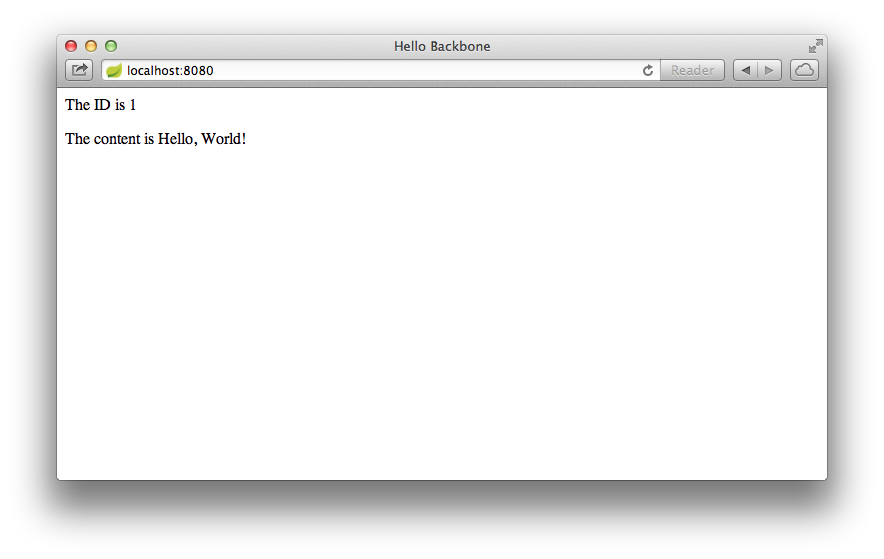

<#assign project_id="gs-consuming-rest-backbone">
This guide walks you through writing a simple Backbone client that consumes a Spring MVC-based [RESTful web service][u-rest].


What you will build
-------------------

You will build a Backbone client that consumes a Spring-based RESTful web service.
Specifically, the client will consume the service created in [Building a RESTful Web Servce][gs-rest-service].

The Backbone client will be accessed by opening the `index.html` file in your browser, and will consume the service accepting requests at:

    http://rest-service.guides.spring.io/greeting

The service will respond with a [JSON][u-json] representation of a greeting:

```json
{"id":1,"content":"Hello, World!"}
```

The client will render the ID and content into the DOM.


What you will need
------------------

 - About 15 minutes
 - A favorite text editor
 - A modern web browser
 - An internet connection


<a name="scratch"></a>
Create a Backbone Model
-----------------------

Backbone consumes data from a RESTful web services via models and collections.  First, you'll create a Backbone model that represents the data you want to consume from the REST service.

	<@snippet path="public/hello/HelloModel.js" prefix="complete"/>

The model extends Backbone's base Model, and sets the model's `urlRoot` to the REST service at http://rest-service.guides.spring.io/greeting.

Create a Backbone View
----------------------

Next, you'll create a Backbone view to render the data in your `HelloModel`.

	<@snippet path="public/hello/HelloView.js" prefix="complete"/>

The view extends Backbone's base View.  The `initialize` method will be called when the view is instantiated.  It uses Underscore to compile a template that will be used to render the model data, saving the compiled template in `this.template`.

Backbone automatically wraps the view's root DOM Node (which will be provided when instantiating the view) in jQuery and makes it available as `this.$el`.  The `render` method renders the compiled template, passing the model data, and then uses jQuery's `html()` method to insert the rendered output into the DOM.

Create a Controller
-------------------

	<@snippet path="public/hello/main.js" prefix="complete"/>

This controller instantiates a `HelloModel`, and then invokes its `fetch` method to fetch data from the REST service and populate the model's data fields.  Then it instantiates a `HelloView`, passing the DOM Node where it should render, and the model.  The view will automatically render the model using its compiled template.

Create the Application Page
---------------------------

Now that you have a model, view, and controller, you'll create the HTML page that will load the client into the user's web browser:

	<@snippet path="public/index.html" prefix="complete"/>

The script element will load curl.js and then load an application boot script named "run.js". The boot script will initialize and configure an AMD module environment and then start the client-side application code.

```html
<script data-curl-run="run.js" src="lib/curl/src/curl.js"></script>
```

Next is the HTML template that your view uses to render the model data.  Note that we use a script tag, with the type `text/html`.  This tells the browser not to try to execute the script tag as JavaScript.  It has an `id` so that it can be easily referenced from the view and compiled.

```html
<script type="text/html" id="hello-template">
    <p>The ID is <%= id %></p>
    <p>The content is <%= content %></p>
</script>
```

Finally, there is the root DOM Node of the view.  The view will render the model data, using the template, into this node:

```html
<div class="hello">
</div>
```

<a name="test"></a>
Test the client
---------------

You can now open the `index.html` page in your browser, where you see:



The ID value will increment each time you refresh the page.


Summary
-------

Congratulations! You've just developed an Backbone client that consumes a Spring-based RESTful web service.

[gs-rest-service]: /guides/gs-rest-service/
[zip]: https://github.com/spring-guides/${project_id}/archive/master.zip
<@u_rest/>
<@u_json/>
<@u_git/>
